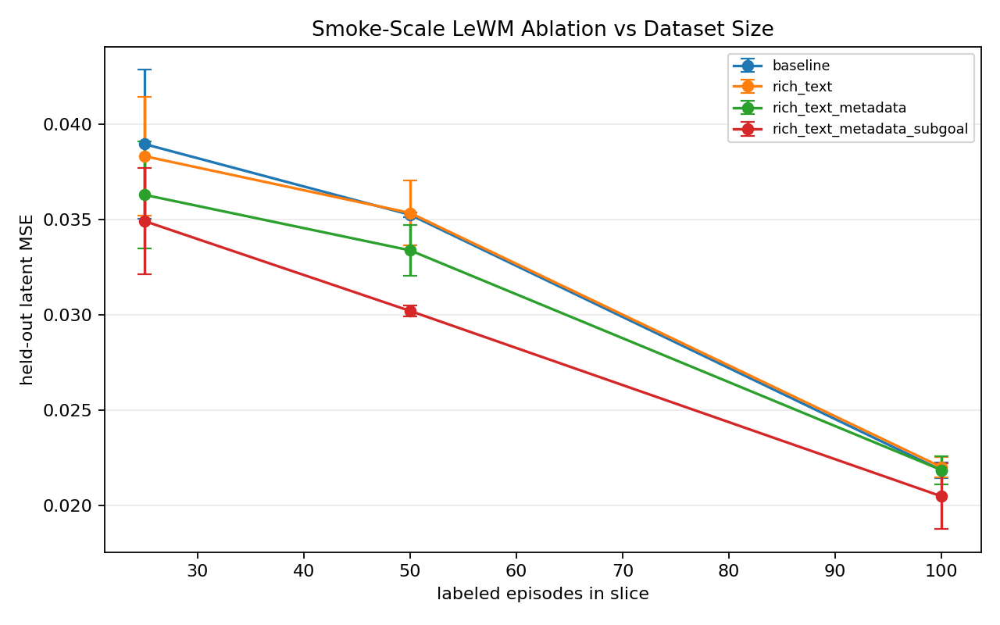

# BridgeEngine Status

Last updated: 2026-06-07

Current best snapshot:

```text
snap_2026_05_11_1dde3edf5d_human_gold_labels
```

Source Gemini snapshot:

```text
snap_2026_05_11_1dde3edf5d
```

## What Is Built

- Deterministic BridgeData V2 ingest into Parquet snapshots.
- Two-stage semantic labelers with swappable VLM backends (`openai`, `gemini`, `moondream`, `mock`).
- pi0.7-shaped labels: subtask segments, episode metadata, and end-of-segment subgoal images.
- Full label provenance, including raw VLM output paths stored outside git.
- DuckDB query layer and deterministic training-cut export.
- Streamlit viewer plus a dedicated review GUI for fast score calibration.
- Quality-gated benchmark runner that refuses bad labels, then runs a real LeWM frozen-adapter smoke ablation.
- Gold-set scaffold and reliability report command.
- Value/anomaly scoring and tiered-compression probes.

## Human Calibration State

Kevin reviewed all 100 clips in the dedicated GUI for score calibration, then reviewed timestamp boundaries on the 50-episode boundary/subgoal subset. Subgoal gold labels are derived from those reviewed subtask end boundaries, because this POC defines subgoals as the actual end-of-segment frame.

```text
score-reviewed clips: 100 / 100
score changes versus Gemini: 58 / 100
boundary-reviewed clips: 50 / 50 subset
subgoal labels: derived from reviewed subtask end_step values
```

Score distribution before and after calibration:

| Source | 1 | 2 | 3 | 4 | 5 |
|---|---:|---:|---:|---:|---:|
| Gemini auto curation | 0 | 5 | 0 | 9 | 86 |
| Kevin score calibration | 0 | 6 | 15 | 30 | 49 |

Source Gemini reliability against Kevin's reviewed labels:

```text
quality exact agreement: 0.42
quality within-one agreement: 0.77
subtask boundary temporal IoU mean: 0.683
derived subgoal frame agreement: 0.347
```

Interpretation: Gemini got the broad score band roughly right most of the time, but exact scoring was poorly calibrated to Kevin's rubric. The subtask segmentations were usable but not gold-quality; after deriving subgoals from Kevin's boundary timestamps, only about a third of auto subgoal frames exactly matched the reviewed boundary end frames.

## Current Quality State

The human-gold-label all-100 snapshot passes the quality gate:

```text
Quality gate: PASS
Episode pass rate: 1.000
Quality counts: {2: 6, 3: 15, 4: 30, 5: 49}
```


## Snapshot Overview


## Benchmark State

The current chart is a real LeWM frozen-adapter scale curve over 100 local episodes, using Kevin-calibrated quality scores, human-reviewed boundaries where available, boundary-derived subgoal frames, a quality-stratified train split, a fixed mixed-quality 10-episode held-out split, and two seeds per family.

Mean held-out latent MSE:

| N | baseline | rich_text | rich_text_metadata | rich_text_metadata_subgoal |
|---:|---:|---:|---:|---:|
| 25 | 0.038967 | 0.038332 | 0.036301 | 0.034922 |
| 50 | 0.035255 | 0.035348 | 0.033385 | 0.030203 |
| 100 | 0.021839 | 0.022000 | 0.021849 | 0.020468 |

Delta versus baseline, lower is better:

| N | rich_text | rich_text_metadata | rich_text_metadata_subgoal |
|---:|---:|---:|---:|
| 25 | -1.63% | -6.84% | -10.38% |
| 50 | +0.26% | -5.30% | -14.33% |
| 100 | +0.73% | +0.04% | -6.28% |

Interpretation: after score and boundary/subgoal correction, the metadata+subgoal family beats baseline at all three tested sizes. Text-only and metadata-only do not hold a stable advantage at N=100. This supports the narrower claim that structured prompt metadata plus subgoal frames are the strongest pi0.7-style signal in this 100-episode LeWM smoke test, but it is not yet a robust robotics conclusion.



## Validation Run

```powershell
.\.venv\Scripts\python.exe -m bridgeengine.derive_subgoals --snapshot snap_2026_05_11_1dde3edf5d --gold-file bridgeengine_data\snapshots\snap_2026_05_11_1dde3edf5d\gold\calibration_gold.json
.\.venv\Scripts\python.exe -m bridgeengine.apply_gold --source-snapshot snap_2026_05_11_1dde3edf5d --target-snapshot snap_2026_05_11_1dde3edf5d_human_gold_labels --gold-file bridgeengine_data\snapshots\snap_2026_05_11_1dde3edf5d\gold\calibration_gold.json --overwrite
.\.venv\Scripts\python.exe -m bridgeengine.quality_report --snapshot snap_2026_05_11_1dde3edf5d_human_gold_labels
.\.venv\Scripts\python.exe -m bridgeengine.benchmark.scale_curve --snapshot snap_2026_05_11_1dde3edf5d_human_gold_labels --sizes 25 50 100 --heldout-count 10 --quality-stratified --benchmark-seeds 0 1 --output-dir scale_results\human_gold_labels_100 --run
.\.venv\Scripts\python.exe -m pytest
```

## What Is Still Blocked

- Only 50 of 100 episodes have explicit human-reviewed subtask boundaries; the remaining 50 use auto boundaries in the applied snapshot.
- The scale curve has only two seeds; the pre-registered head-to-head should use 3-5 seeds.
- Perceptive mask/depth/track labels are not ready for the final head-to-head; `bridgeengine.perceptive_status --require-real` currently fails because no perceptive rows are present on the calibrated snapshot.
- The local SSD source exposes 100 episodes, not the full BridgeData V2 corpus.
- Standard RLDS/LeRobot export is not implemented.
- This should be framed as a calibrated smoke result, not a settled claim that pi0.7-style conditioning improves robot learning.

## Next Command For Kevin

```powershell
.\.venv\Scripts\python.exe -m bridgeengine.perceptive_status --snapshot snap_2026_05_11_1dde3edf5d_human_gold_labels --require-real
```

That command should fail until real SAM/depth/track outputs are present. Passing it is the next critical path before the final pi0.7-vs-perceptive head-to-head claim.
