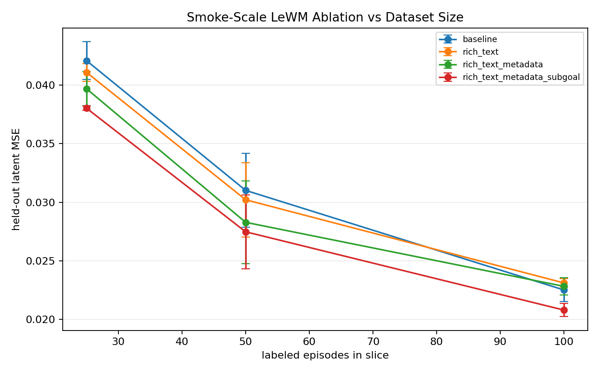

# BridgeEngine Status

Last updated: 2026-06-05

Current best snapshot:

```text
snap_2026_05_11_1dde3edf5d_human_calibrated
```

Source Gemini snapshot:

```text
snap_2026_05_11_1dde3edf5d
```

## What Is Built

- Deterministic BridgeData V2 ingest into Parquet snapshots.
- Two-stage semantic labelers with swappable VLM backends (`openai`, `gemini`, `moondream`, `mock`).
- pi0.7-shaped labels: subtask segments, episode metadata, and end-of-segment subgoal images.
- Full label provenance, including raw VLM output paths stored outside git.
- DuckDB query layer and deterministic training-cut export.
- Streamlit viewer plus a dedicated review GUI for fast score calibration.
- Quality-gated benchmark runner that refuses bad labels, then runs a real LeWM frozen-adapter smoke ablation.
- Gold-set scaffold and reliability report command.
- Value/anomaly scoring and tiered-compression probes.

## Human Calibration State

Kevin reviewed all 100 clips in the dedicated GUI and changed scores only:

```text
reviewed clips: 100 / 100
score changes versus Gemini: 58 / 100
review notes intentionally entered: 0
calibration reasons intentionally entered: 0
subtask-boundary toggles used: 0
subgoal toggles used: 0
```

Score distribution before and after calibration:

| Source | 1 | 2 | 3 | 4 | 5 |
|---|---:|---:|---:|---:|---:|
| Gemini auto curation | 0 | 5 | 0 | 9 | 86 |
| Kevin score calibration | 0 | 6 | 15 | 30 | 49 |

This is score calibration, not full gold annotation. Boundary IoU and subgoal-selection agreement are still unmeasured.

## Current Quality State

The human-calibrated all-100 snapshot passes the quality gate:

```text
Quality gate: PASS
Episode pass rate: 1.000
Quality counts: {2: 6, 3: 15, 4: 30, 5: 49}
```


## Snapshot Overview


## Benchmark State

The current chart is a real LeWM frozen-adapter scale curve over 100 local episodes, using a quality-stratified train split, a fixed mixed-quality 10-episode held-out split, and two seeds per family.

Mean held-out latent MSE:

| N | baseline | rich_text | rich_text_metadata | rich_text_metadata_subgoal |
|---:|---:|---:|---:|---:|
| 25 | 0.042079 | 0.041079 | 0.039682 | 0.038022 |
| 50 | 0.031014 | 0.030213 | 0.028289 | 0.027482 |
| 100 | 0.022522 | 0.023123 | 0.022831 | 0.020807 |

Delta versus baseline, lower is better:

| N | rich_text | rich_text_metadata | rich_text_metadata_subgoal |
|---:|---:|---:|---:|
| 25 | -2.38% | -5.70% | -9.64% |
| 50 | -2.58% | -8.79% | -11.39% |
| 100 | +2.67% | +1.37% | -7.61% |

Interpretation: after score calibration, the metadata+subgoal family beats baseline at all three tested sizes. Text-only and metadata-only help at N=25 and N=50 but regress slightly at N=100. This is a positive smoke-scale result, not a robust robotics conclusion.



## Validation Run

```powershell
.\.venv\Scripts\python.exe -m bridgeengine.quality_report --snapshot snap_2026_05_11_1dde3edf5d_human_calibrated
.\.venv\Scripts\python.exe -m bridgeengine.benchmark.scale_curve --snapshot snap_2026_05_11_1dde3edf5d_human_calibrated --sizes 25 50 100 --heldout-count 10 --quality-stratified --benchmark-seeds 0 1 --output-dir scale_results\human_calibrated_100 --run
.\.venv\Scripts\python.exe -m pytest
```

## What Is Still Blocked

- Subtask boundary and subgoal labels are not human-gold validated; use `gold_sets/boundary_subgoal_review_50.json` with `--review-goal boundary_subgoal`.
- The scale curve has only two seeds.
- Perceptive mask/depth/track labels are not ready for the final head-to-head; `bridgeengine.perceptive_status --require-real` currently fails because no perceptive rows are present on the calibrated snapshot.
- The local SSD source exposes 100 episodes, not the full BridgeData V2 corpus.
- Standard RLDS/LeRobot export is not implemented.
- This should be framed as a calibrated smoke result, not a settled claim that pi0.7-style conditioning improves robot learning.

## Next Command For Kevin

```powershell
.\.venv\Scripts\python.exe -m bridgeengine.review_gui `
  --snapshot snap_2026_05_11_1dde3edf5d `
  --gold-file C:\Users\Kevin\projects\annotation_pipeline\bridgeengine_data\snapshots\snap_2026_05_11_1dde3edf5d\gold\calibration_gold.json `
  --episode-file gold_sets\boundary_subgoal_review_50.json `
  --review-goal boundary_subgoal `
  --port 8787
```
