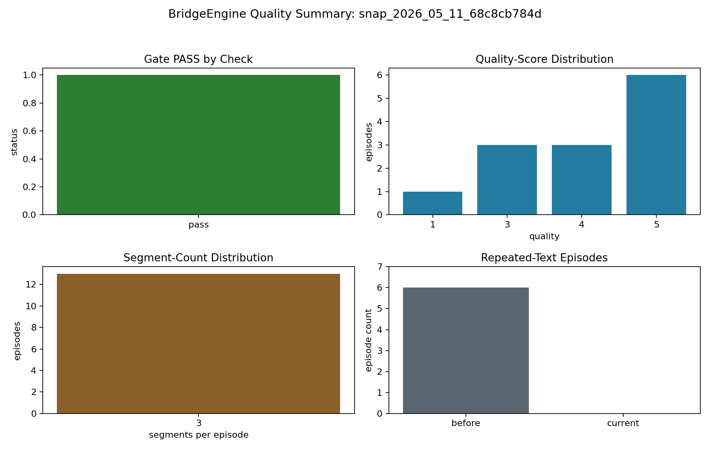
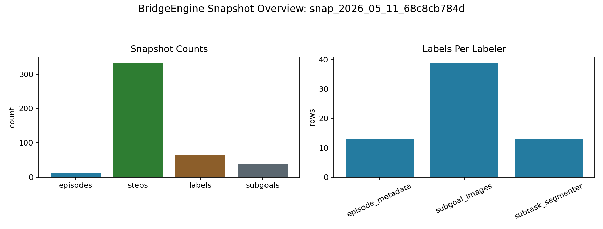
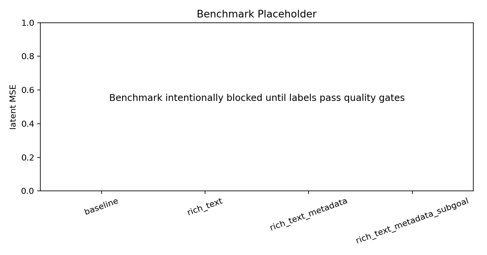

# BridgeEngine Status

Current OpenAI-backed snapshot visualized: `snap_2026_05_11_68c8cb784d`

Comparison snapshot: `snap_2026_05_11_a8256b172c`

## What Is Built

- Deterministic BridgeData V2 ingest into Parquet snapshots.
- Two-stage semantic labelers with swappable VLM backends (`openai`, `moondream`, `mock`).
- pi0.7-shaped labels: subtask segments, episode metadata, and end-of-segment subgoal images.
- Full label provenance, including raw VLM output paths stored outside git.
- DuckDB query layer and deterministic training-cut export.
- Streamlit viewer with episode frames, labels, provenance, query outputs, and generated status figures.
- Quality-gated benchmark scaffold that refuses bad labels.
- Gold-set scaffold and reliability report command.

## Current Quality State

The OpenAI-backed relabel passes the quality gate on all 13 episodes.

```text
Quality gate: PASS
Episode pass rate: 1.000
Quality counts: {1: 1, 3: 3, 4: 3, 5: 6}
```

The previous failure modes were:

- Repeated templated subtask text: resolved by using live OpenAI two-stage observe-then-label output instead of deterministic fallback labels.
- Metadata score/reason contradictions: resolved in the labels and by making the gate distinguish negated phrases such as "no wrong destination" from real failure claims.
- Object-grounding gaps: resolved in the label set; the gate now ignores action/time words such as `pickup`, `before`, and `withdraw` as non-object tokens.
- Quality-score collapse: resolved. The current distribution spans 1, 3, 4, and 5.



## Snapshot Overview



## Benchmark State

The benchmark chart is intentionally a placeholder until Kevin inspects label quality and approves starting the real LEWM grid.



## Human Inspection

Three full example payloads are committed at:

```text
examples/openai_label_samples_snap_2026_05_11_68c8cb784d.json
```

The real subgoal frames and raw VLM outputs remain local-only and ignored by git.

## Validation Run

```powershell
.\.venv\Scripts\python.exe -m bridgeengine.quality_report --snapshot snap_2026_05_11_68c8cb784d
.\.venv\Scripts\python.exe -m bridgeengine.figures --snapshot snap_2026_05_11_68c8cb784d --compare-snapshot snap_2026_05_11_a8256b172c
.\.venv\Scripts\python.exe -m pytest
```

Latest local result: `11 passed`.

## What Is Still Blocked

- Human review of label quality is still the stop point before running the real LEWM benchmark.
- The reliability report is wired, but Kevin still needs to fill the gold labels; the example file is intentionally not a real gold set.
- No benchmark claim should be made yet. The current result is that the labeling pipeline is benchmark-ready, not that a model result exists.
